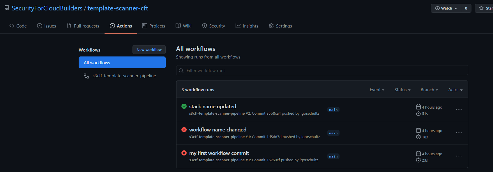

# Securing for CloudFormation Templates
Uma meneira de integrar mais segurança ao seu CI e sua infraestrutura como código (IaaC)!
 - Este projeto tem como objetivo verificar o nível de conformidade do seu código CloudFormation à respeito das boas práticas de arquitetura sugeridas pela AWS;
 - Usamos o <a href="https://docs.github.com/pt/actions"> GitHub Actions </a> para automatizar o deployment do nosso CloudFormation na AWS apenas se estiver compliance com nossa política de boas práticas de arquitetura de Cloud;
 - Lembre-se de alterar o nome do Bucket S3 no arquivo "s3-bucket-sfcb.yml", pois eles precisam ser únicos globalmente. Caso contrário o seu deploy irá falhar. 
 - Se desejar mais informações sobre o seu código antes de realizar o deployment, você pode utilizar a <a href="https://marketplace.visualstudio.com/items?itemName=raphaelbottino.cc-template-scanner"> extensão do Cloud Conformity </a> no seu Visual Studio Code!

 </img>

### Você precisará:

-   1 Conta da AWS com usuário com que tenha direitos de administrador ou direitos de executar CloudFormation Templates;
-   Ter o Git instalado localmente na sua máquina; 
-   1 Conta já criada no <a href="https://cloudone.trendmicro.com/"> Trend Micro Cloud One Conformity</a>; 

### Links para refêrencia:

- <a href="https://www.trendmicro.com/pt_br/business/products/hybrid-cloud/cloud-one-conformity.html"> Introdução ao Trend Micro Conformity </a>

- <a href="https://www.cloudconformity.com/help/public-api/api-keys.html"> Como criar uma chave de API no Trend Micro Conformity </a>

- <a href="https://www.cloudconformity.com/help/add-cloud-account/add-an-aws-account.html"> Adicione sua conta AWS no Trend Micro Conformity </a> 

- <a href="https://www.cloudconformity.com/help/template-scanner.html"> Cloud Conformity Template Scanner </a> 

### Essa demo irá criar:

-   1 Stack no AWS CloudFormation;
-   1 Bucket no AWS S3;

 

 

## Como Usar:

 

  
:zap: USANDO O GitHub Actions para criar AWS CloudFormation Templates

 

## Caso você já tenha uma Action configurada para esta ação, pode pular essa etapa e testar o seu código já existente.

 

1 - Clone este Repositório para a sua máquina: https://github.com/SecurityForCloudBuilders/template-scanner-cft.git

    git clone https://github.com/SecurityForCloudBuilders/template-scanner-cft.git

2 - Crie uma Actions no seu repositório do GitHub -> Actions -> Simple workflow

 </img>

 </img>

 </img>

3 - <a href="https://github.com/aws-actions/configure-aws-credentials"> Configure AWS Credentials </a> Action for GitHub Actions

 </img>

3.5 - Adicione as variáveis de AWS_SECRET_KEY_ID e AWS_SECRET_ACCESS_KEY solicitadas na etapa anterior no seu repositório como SECRETS

 </img>

4 - Volte para o seu workflow e adicione a Action <a href="https://github.com/marketplace/actions/aws-cloudformation-deploy-cloudformation-stack-action-for-github-actions"> Deploy CloudFormation Stack </a> Action for GitHub Actions
 - Lembre-se de alterar o nome do Bucket S3 no arquivo "s3-bucket-sfcb.yml", pois eles precisam ser únicos globalmente. Caso contrário o seu deploy irá falhar. 

 </img>

5 - Ao fazer o "commit" na etapa anterior, o Github já deverá criar um stack na sua conta AWS no serviço CloudFormation 

 </img>

 </img>

 </img>

 

 

  
:hand: INTEGRANDO O CONFORMITY TEMPLATE SCANNER PARA VALIDAR A CONFORMIDADE DO SEU CLOUDFORMATION TEMPLATE 

6 - Agora, faça o deploy do <a href="https://github.com/marketplace/actions/cloud-one-conformity-pipeline-scanner"> Cloud One Conformity Pipeline Scanner </a>

 </img>

6.5 - Esse script precisa que você providencie a sua <a href="https://www.cloudconformity.com/help/public-api/api-keys.html">chave de API do Trend Micro Conformity </a> como SECRET no seu repositório, assim como fizemos no passo 3 com as chaves de acesso da AWS e que configure os limites máximos de violações por severidade. 

7 - Ao configurar essas mudanças no seu Workflow, o Conformiy irá validar seu código CloudFormation e caso esteja de acordo com os limites estipulados no passo anterior, ele irá realizar o deploy do Stack no seu CloudFormation. Caso contrário, ele irá quebrar seu pipeline por conta dos riscos que infraestrutura pode causar por não ser segura/compliance.

 </img>

7.5 - Para ver o resultado do Scan, vá em "Actions" e poderá acompanhar o resultado de cada execução que foi realizada pelo GitHub Acionts

 </img>

### WARNING:

        - Este projeto é para o propósito de Demostrações! 
        - Não foi criado para ser usado em produção ou com dados sensiveis!
